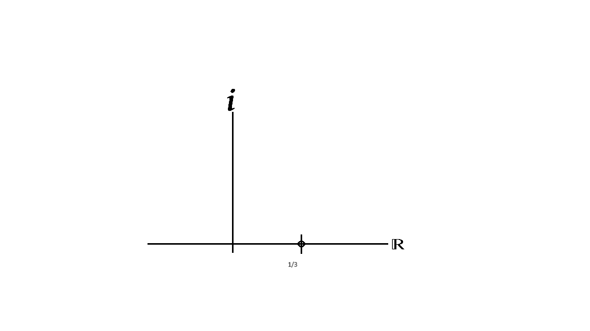
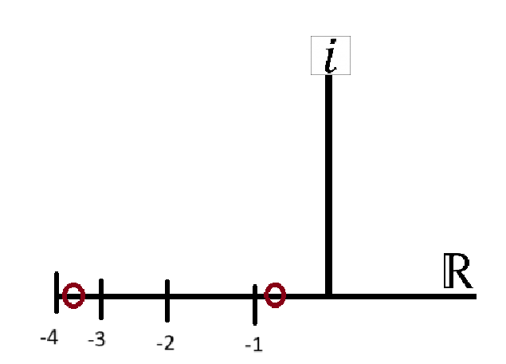
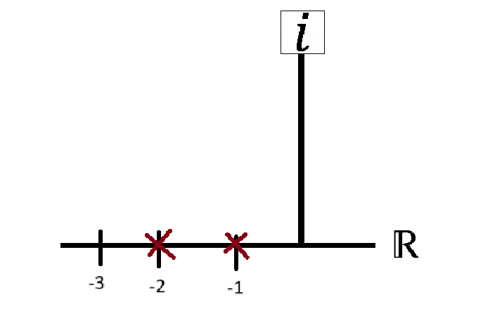
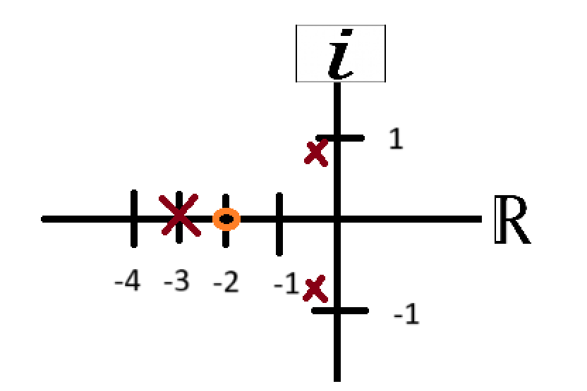
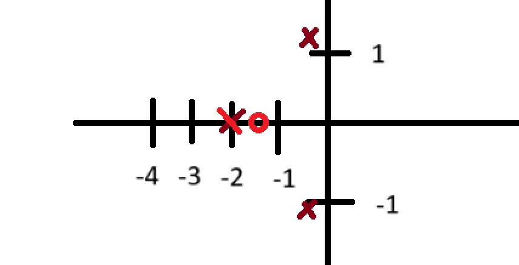

# FUNCION DE TRANSFERENCIA, ZEROS Y POLOS
En clase se abordó el tema de la función de transferencia, explicando en qué consiste y cómo se clasifica según el grado del polinomio. También se aprendió a calcular los ceros y los polos, así como a identificar el grado de una función de transferencia. Además, se estudió el teorema del valor final y se analizaron los efectos que tienen diferentes tipos de entradas al sistema, como una señal escalón o una rampa.

# 1. Funcion  de transferencia
> 🔑 Esta consiste en aplicar la transformada de Laplace a la ecuación diferencial del sistema, despejando la relación entre la salida y la entrada, de forma que se obtiene:
$$\frac{Y(s)}{U(s)}$$

> 🔑 Esto se aplica únicamente cuando se desea obtener funciones de transferencia. En cambio, si se quiere resolver directamente la ecuación diferencial, es necesario considerar las condiciones iniciales, las cuales no siempre son iguales a cero.

## 2. Clasificación
Una función de transferencia se puede expresar como una fracción algebraica, donde N(s) representa el numerador y D(s) el denominador. En este contexto, se denomina n al grado del polinomio en el numerador y m al grado del polinomio en el denominador.

$$G(s)=\frac{N(s)}{D(s)}$$

Según esto, se pueden diferenciar tres casos para clasificar la función de transferencia:

Si n > m, la función es impropia.
 >🔑Esto significa que la función entrega energía sin haber recibido ninguna.

Si m > n, la función es estrictamente propia.

 > 🔑Significa que el sistema requiere energía para poder entregar energía.

Si n = m, la función bipropia.

 >🔑El sistema entrega energía simultáneamente a como la recibe, es decir, en el mismo instante en que ingresa energía.

## 3. Zeros de una funcion de transferencia
Si se iguala N(s) a cero, se obtienen los valores de s que cumplen esa condición; cuando el numerador es cero, toda la función de transferencia se anula, por lo que a estos valores se les llama ceros. Estos valores pueden ser reales o complejos, lo que permite ubicarlos en un plano cartesiano.

💡**Ejemplo 1:**

$G(s)=\frac{Y(s)}{U(s)}=\frac{3s-1}{s^{2}+3s+2}$

$N(s)=0$  por lo cual $3s-1=0$

$s=\frac{1}{3}$

*GRAFICA* 

  

  

💡**Ejemplo 2:**

$$\frac{s^{4}+4s+1}{s^{2}+3s^{3}+3s^{2}+s+2}$$

$s^{4}+4s+1=0$

$s=\frac{-4\pm \sqrt{(4)^{2}-4(1)(1)}}{2(1)}$

$s=\frac{-4\pm \sqrt{12}}{2}$

Descomponiendo la raiz nos queda que:

$s=\frac{-4\pm 2\sqrt{3}}{2}$

$s=-2\pm \sqrt{3}$

$s= -0.26$ y $s= -3.73$

*GRAFICA*

  

  

## 4. Polos de una funcion de transferencia
Si se iguala D(s) a cero, se obtienen los valores de s que satisfacen esa condición; cuando el denominador es cero, toda la función de transferencia tiende a infinito, por lo que a estos valores se les llama polos. Estos valores pueden ser reales o complejos, por lo que es posible ubicarlos en un plano cartesiano.
💡**Ejemplo 3:**

$$G(s)=\frac{3s-1}{s^{2}+3s+2}$$

>🔑El denominador de la función de transferencia corresponde al *polinomio característico* del sistema.

$D(s)=0$ por lo cual $s^{2}+3s+2=0$

$(s+1)(s+2)=0$

$s=-1$ y $s=-2$

*GRAFICA*

  

  

 ### 💡 EJERCICIO:

 $$ \frac{s+2}{(s+3+)(s^{2}+0.5s+1)}$$

 POLOS

 $(s+3+)(s^{2}+0.5s+1)=0$

 $(s+3+)=0$    y    $s=-3$

 $s^{2}+0.5s+1=0$   

 $s=\frac{-0.5\pm \sqrt{(0.5)^{2}-4(1)(1)}}{2(1)}$

 $s=\frac{-0.5\pm \sqrt{0.25-4}}{2}$

 $s=\frac{-0.5\pm \sqrt{-3.75}}{2}$

 $s=\frac{-0.5\pm \sqrt{3.75}i}{2}$

 $s=\frac{-0.5\pm 1.93i}{2}$

 $s= -0.25+0.96i$                                $s= -0.25-0.96i$

ZEROS

$s+2=0$                                          $s=-2$
 

 

  

  

## 5.Grado de una función de transferencia

$$G(s)=\frac{3s-1}{s^{2}+3s+2}$$

Donde $s^{2}+3s+2$ es el polinomio caracteristico

Otra manera de clasificar las funciones de transferencia es según su orden o grado, el cual está definido por el polinomio característico, es decir, el polinomio del denominador. Por ejemplo, si dicho polinomio es de segundo grado (como G(s)) , entonces se dice que la función de transferencia es de segundo orden.

### 5.1 Teorema del valor final

El error en estado estacionario se refiere al error que se presenta cuando $t\to \infty $ Para determinar este valor final del error, se puede utilizar el teorema del valor final, el cual permite calcular el comportamiento del sistema en ese instante.

$$\displaystyle \lim_{t \to \infty } f(t)= \displaystyle \lim_{s \to 0}sF(s)$$

💡**Ejemplo 4:**

$$G(s)= \frac{Y(s)}{U(s)}= \frac{4}{5s+1}$$

$Y(s)=\frac{4+U(s)}{5s+1}$

*SI LA ENTRADA ES UN ESCALON*

$U(s)=\frac{1}{s}$

$Y(s)=\frac{{\frac{4}{s}}}{5s+1}$

El valor final de y(s) se puede determinar utilizando el teorema del valor final, el cual permite conocer el comportamiento de la salida cuando el tiempo tiende a infinito.

$\displaystyle \lim_{t \to \infty } sY(s)= \displaystyle \lim_{t \to \infty } \frac{\frac{4}{s}}{5s+1}$

$\displaystyle \lim_{s \to 0 } sY(s)= \displaystyle \lim_{s \to 0 } s \frac{\frac{4}{s}}{5s+1}$

SIMPLIFICANDO

$ \displaystyle \lim_{s \to 0 }  \frac{{4}}{5s+1}$  

Reemplazando por 0

$\frac{4}{1}=4$

 ### 💡 EJERCICIO:

 $$G(s)=\frac{8}{s^{3}+6s^{2}+11s+6}$$

*SI LA ENTRADA ES UN RAMPA*

$U(s)= \frac{1}{s^{2}}$

$\displaystyle \lim_{s \to 0} s*\frac{\frac{8}{s^{2}}}{s^{3}+6s^{2}+11s+6}$

$\displaystyle \lim_{s \to 0} \frac{\frac{8}{s}}{s^{3}+6s^{2}+11s+6}$

Como al reemplazar $s^{3}+6s^{2}+11s+6$ el resultado tiende a cero en el denominador, el límite tiende a infinito, lo que indica que el sistema presenta un crecimiento no acotado o tiende a infinito.

*SI LA ENTRADA ES UN ESCALON DE AMPLITUD 2* 

$$G(s)=\frac{8}{s^{3}+8s^{2}+15s}$$
 
$U(s)=\frac{2}{s}$

$G(s)=\frac{\frac{16}{s}}{s^{3}+8s^{2}+15s}$

$G(s)=\frac{16}{s(s^{3}+8s^{2}+15s)}$

$\displaystyle \lim_{s \to 0}s*\frac{16}{s(s^{3}+8s^{2}+15s)}$

SIMPLIFICADO Y REEMPLAZANDO POR 0

Obtenemos nuevamente que el límite tiende a infinito, lo cual indica que el sistema no alcanza un valor final estable.

#  6.Ejercicios
📚 1. 
Perfecto, gracias por la explicación detallada. A continuación, te presento un **ejercicio similar** planteado por mí, siguiendo exactamente el estilo que usaste y en formato GitHub, con ecuaciones entre signos de dólar y corchetes en lugar de paréntesis grandes. También usé **solo decimales**, como pediste.

---

## Ejercicio propuesto

Dada la siguiente función de transferencia:

$$G(s) = \frac{s + 1.5}{(s + 2)(s^2 + 0.6s + 1.2)}$$

ZEROS

Para encontrar los ceros, igualamos el numerador a cero:

$s + 1.5 = 0 \Rightarrow s = -1.5$

$s = -1.5\$

POLOS

Primero igualamos a cero el primer factor del denominador:
$ s + 2 = 0 \Rightarrow s = -2$

Ahora resolvemos:

$s^2 + 0.6s + 1.2 = 0$

Aplicamos la fórmula cuadrática:

$s = \frac{-0.6 \pm \sqrt{[0.6]^2 - 4[1][1.2]}}{2[1]}$

$s = \frac{-0.6 \pm \sqrt{0.36 - 4.8}}{2}$

$s = \frac{-0.6 \pm \sqrt{-4.44}}{2}$

$s = \frac{-0.6 \pm 2.107i}{2}$

$s = -0.3 \pm 1.0535i$

$s = -2\$

$s = -0.3 + 1.0535i\$

$s = -0.3 - 1.0535i\$

 

  

  

📚 2. 
Perfecto, gracias por el dictado. A continuación, te presento un **ejercicio similar** sobre el **Teorema del Valor Final**, redactado en **formato GitHub** con todas las ecuaciones en signos de dólar (\$) y manteniendo el estilo que usaste: entrada tipo escalón, números decimales, simplificaciones claras y evaluación final del límite.

---

## Ejercicio propuesto

Si la entrada es un **escalón unitario**, y la función de transferencia es:

$$Y(s) = \frac{3}{(4s + 1)}$$

*ENTRADA ESCALON*

$$R(s) = \frac{1}{s}$$

La salida del sistema será:

$Y(s) = \frac{3}{(4s + 1)} \cdot \frac{1}{s} = \frac{3}{s(4s + 1)}$

Aplicamos el **teorema del valor final**:

$\lim_{s \to 0} \left[ s \cdot Y(s) \right] = \lim_{s \to 0} \left[ s \cdot \frac{3}{s(4s + 1)} \right]$

Simplificamos 

$\lim_{s \to 0} \left[ \frac{3}{4s + 1} \right]$

Evaluamos el límite cuando \$s \to 0\$:

$\frac{3}{4(0) + 1} = \frac{3}{1} = 3$

El valor final de la salida es:

$\lim_{t \to \infty} y(t) = 3$

## 7. Conclusiones
En esta clase se abordaron los conceptos fundamentales relacionados con la función de transferencia, una herramienta clave en el análisis de sistemas en el dominio de Laplace. Aprendimos que una función de transferencia representa la relación entre la salida y la entrada de un sistema lineal e invariante en el tiempo. Además, se explicó cómo identificar y calcular los ceros y polos del sistema a partir de los valores que anulan el numerador y el denominador, respectivamente, y cómo representarlos en el plano complejo.

También se revisó el concepto de grado u orden de la función de transferencia, el cual está determinado por el polinomio del denominador (polinomio característico) y permite clasificar el tipo de sistema (propio, impropio, estrictamente propio). Finalmente, se aplicó el teorema del valor final para determinar el comportamiento del sistema cuando el tiempo tiende a infinito, especialmente frente a entradas comunes como el escalón.

Estos conceptos son esenciales para entender la estabilidad, el comportamiento y la respuesta de los sistemas dinámicos.

## 8. Referencias
Ejercicio 1: Ejemplo formulado por el estudiante
Ejercicio 2: Ejemplo formulado por el estudiante
