# Modelamiento mediante Diagramas de Bloques
Los diagramas de bloques constituyen una herramienta fundamental en el modelamiento y análisis de sistemas dinámicos. Su utilidad radica en representar visualmente la relación funcional entre los distintos componentes de un sistema, facilitando el diseño, la comprensión y la implementación de sistemas de control. Este tipo de modelamiento se basa en el uso de funciones de transferencia para representar los elementos del sistema y su interacción a través de señales de entrada y salida. Se aplica comúnmente en ingeniería eléctrica, mecánica, térmica, hidráulica, y procesos químicos, permitiendo una transición eficiente entre el modelo físico y su análisis computacional.
## 1. Subtítulos
1.1 Introducción al modelamiento de sistemas dinámicos

1.2 ¿Qué es un diagrama de bloques?

1.3 Elementos fundamentales de los diagramas de bloques

1.4 Diagramas de bloques aplicados a diferentes dominios físicos

1.5 Transformación de ecuaciones diferenciales a diagramas de bloques

1.6 Ventajas y limitaciones del modelamiento por bloques

## 2. Definiciones
🔑 Sistema físico: conjunto de elementos interconectados que interactúan mediante el intercambio de energía y/o materia.

🔑 Modelamiento: proceso de construcción de una representación matemática o gráfica de un sistema real.

🔑 Diagrama de bloques: representación gráfica de un sistema donde cada bloque representa una operación matemática o función de transferencia.

🔑 Función de transferencia: cociente de la transformada de Laplace de la salida sobre la transformada de Laplace de la entrada, bajo condiciones iniciales nulas.

🔑 Nodo de suma: elemento que realiza la suma algebraica de señales que entran al sistema.

🔑 Punto de ramificación: punto desde el cual una señal se dirige a varios bloques simultáneamente.


## 3. Subsecciones
### 3.1. Modelado de sistemas de mezcla

En los sistemas de mezcla, se considera un tanque donde entran dos flujos con distintas concentraciones. Se busca obtener una expresión que modele la concentración de la mezcla dentro del tanque a lo largo del tiempo, considerando el balance de masa.
 
### 3.2. Modelado de sistemas térmicos

El modelado térmico considera la transferencia de calor entre un cuerpo y su entorno. A través de la ley de conservación de energía y elementos como resistencia térmica y capacidad térmica, se forma una ecuación diferencial que se transforma en una función de transferencia.

### 3.3. Modelado de sistemas eléctricos equivalentes

El modelamiento eléctrico se utiliza como analogía para representar sistemas de otros dominios (ej: masa-resorte-amortiguador en forma de circuitos RLC) facilitando su análisis mediante componentes conocidos como resistencias, inductancias y capacitancias.

### 3.4. Diagramas de bloques con retroalimentación

Los diagramas de bloques permiten representar la realimentación (feedback) mediante la conexión de una parte de la salida nuevamente a la entrada. Esta configuración es esencial en sistemas de control y regulación.
## 4. Ejemplos
💡 Ejemplo 1: Sistema de mezcla en tanque continuo

Se tienen dos entradas de flujo $Q_1$ y $Q_2$ con concentraciones $C_1$ y $C_2$ respectivamente. Se desea modelar la concentración $C(t)$ dentro del tanque.


Figura 1. Diagrama de bloques del sistema de mezcla.

💡 Ejemplo 2: Sistema térmico con disipación

Un sistema térmico recibe calor a través de una fuente $q(t)$ y disipa energía hacia el ambiente $T_a$. Se representa mediante un modelo térmico con resistencia $R$ y capacidad térmica $C$.


Figura 2. Diagrama de bloques del sistema térmico.

💡 Ejemplo 3: Sistema masa-resorte-amortiguador

Se desea modelar un sistema mecánico clásico formado por una masa $m$, un resorte con constante $k$ y un amortiguador con coeficiente de fricción $b$. La entrada es una fuerza $F(t)$.


Figura 3. Diagrama de bloques del sistema masa-resorte-amortiguador.

## 5. Ecuaciones
💡 Ejemplo 1 (Mezcla):

Ecuación diferencial:

$$\frac{dC(t)}{dt}=\frac{Q1(C1-C(t))+Q2(C2-C(t))}{V}$$

Transformada de Laplace:

$$C(s)=\frac{Q1C1+Q2C2}{Vs+(Q1+Q2)}$$

💡 Ejemplo 2 (Térmico):

Ecuación diferencial:

$$C\frac{DT(t)}{dt}+\frac{T(t)-Ta}{R}=q(t)$$

Transformada de Laplace:

$$T(s)=\frac{R}{RCs+1}Q(s)+\frac{1}{RCs+1}Ta$$

💡 Ejemplo 3 (Masa-resorte-amortiguador):

Ecuación diferencial:

$$F(t)=m\frac{d^{2}x(t)}{dt^{2}}+b\frac{dx(t)}{dt}+kx(t)$$

Transformada de Laplace:

$$X(s)=\frac{1}{ms^{2}+bs+k}F(s)$$

## 6. Figuras

💡**Ejemplo 1:**

 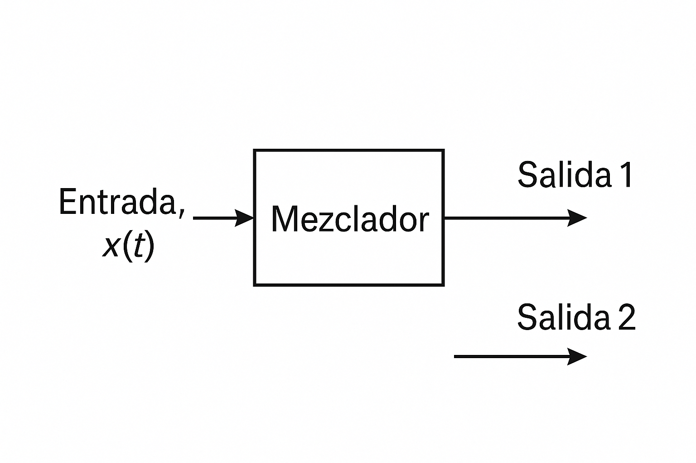


💡**Ejemplo 2:**

 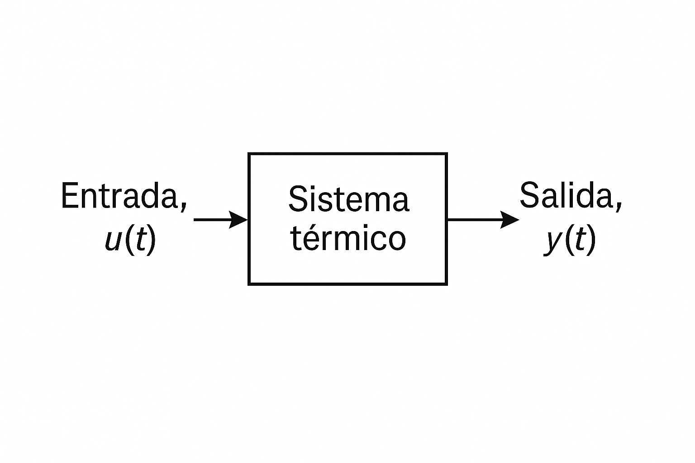


💡**Ejemplo 3:**

 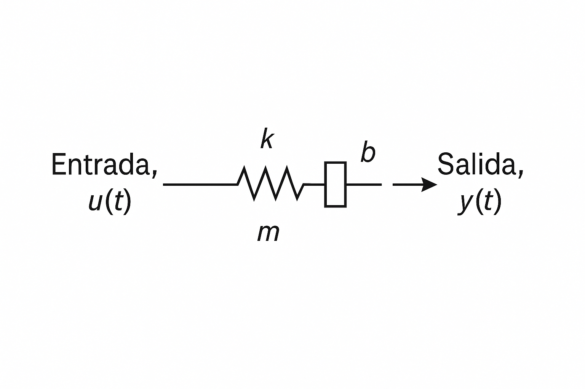


## 7. Código
💡 Código simbólico en Python:

```
import sympy as sp

# Modelo mezcla
t, s = sp.symbols('t s')
Q1, Q2, C1, C2, V = sp.symbols('Q1 Q2 C1 C2 V')
C_s = (Q1*C1 + Q2*C2) / (V*s + Q1 + Q2)
sp.pprint(C_s)

# Modelo térmico
R, C, Ta, Qs = sp.symbols('R C T_a Q')
T_s = R / (R*C*s + 1) * Qs + (1 / (R*C*s + 1)) * Ta
sp.pprint(T_s)

# Modelo mecánico
m, b, k, F = sp.symbols('m b k F')
X_s = F / (m*s**2 + b*s + k)
sp.pprint(X_s)
```

## 8. Ejercicios

📚 Ejercicio 1: Obtener la función de transferencia del siguiente diagrama de bloques:

 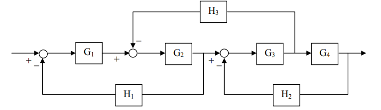


Paso a paso

 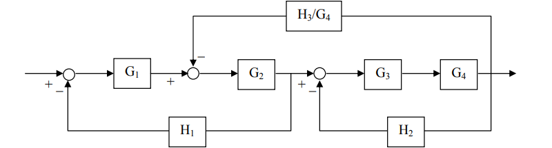

 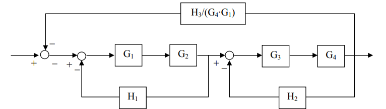

 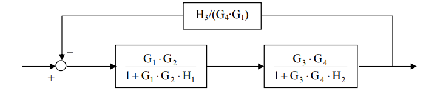

 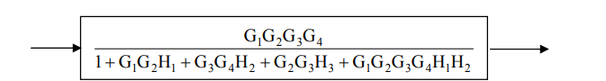


📚 Ejercicio 2: Obtener la función de transferencia simplificada correspondiente al siguiente diagrama de bloques.

 


Paso 1
Aplicamos la regla 5 de la tabla para bloques en paralelo, sumando así G2 y G3.

 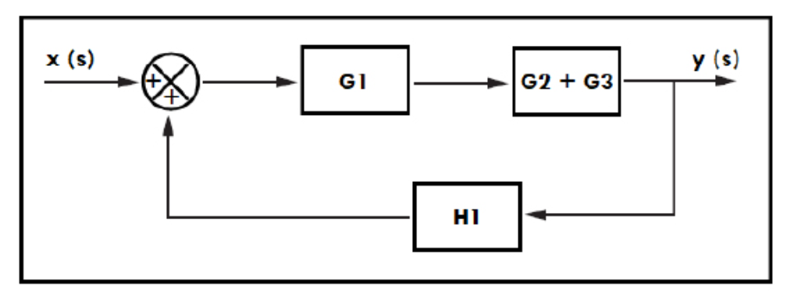


Paso 2
Después, con la regla 4 para combinación de bloques reducimos G1:

 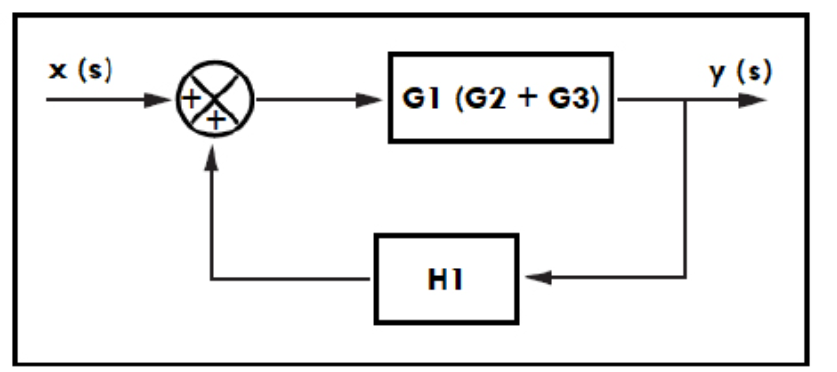


Paso 3
Por último, aplicamos la regla 13 para eliminar la retroalimentación y así obtenemos nuestro bloque equivalente.

 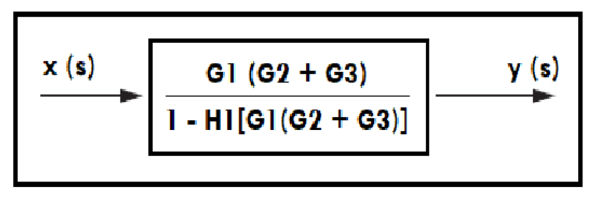


## 9. Conclusiones
Los diagramas de bloques permiten modelar sistemas de forma visual y modular.

Facilitan la obtención de funciones de transferencia y el análisis de estabilidad y respuesta.

Son útiles en una amplia variedad de dominios físicos.

Su integración con herramientas simbólicas como Python/SymPy mejora el análisis.

## 10. Referencias

Ogata, K. (2010). Ingeniería de Control Moderna.

Nise, N. (2015). Sistemas de Control en Ingeniería.

Apuntes del curso: Modelamiento de sistemas dinámicos.

Simulaciones y resolución simbólica con SymPy (Python).

https://suayed.cuautitlan.unam.mx/uapas/4/
