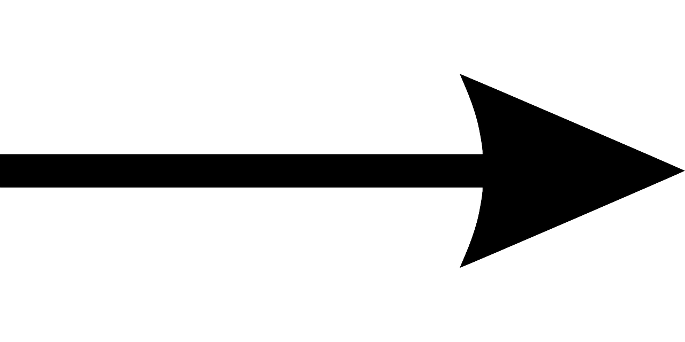
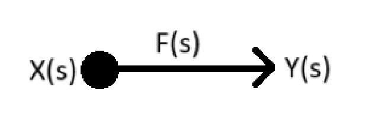
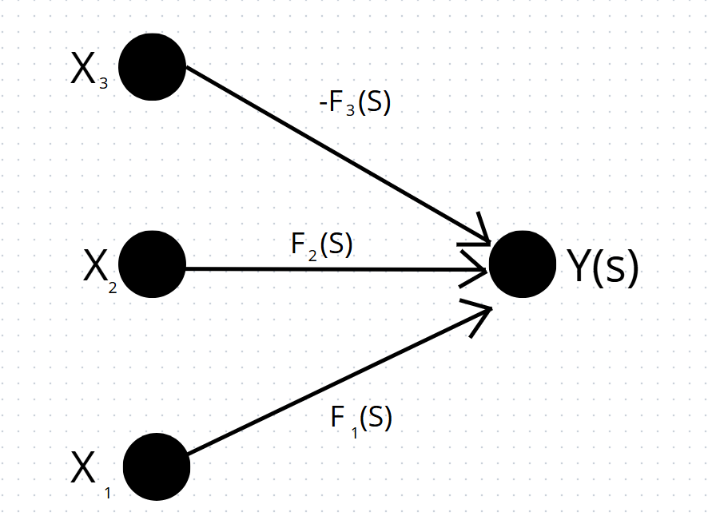
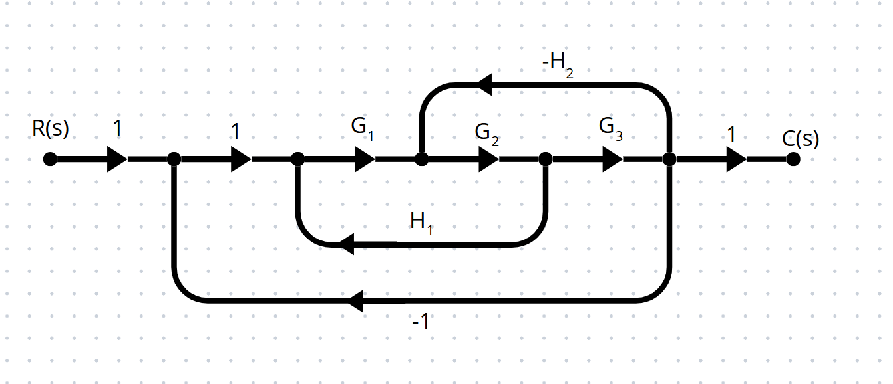
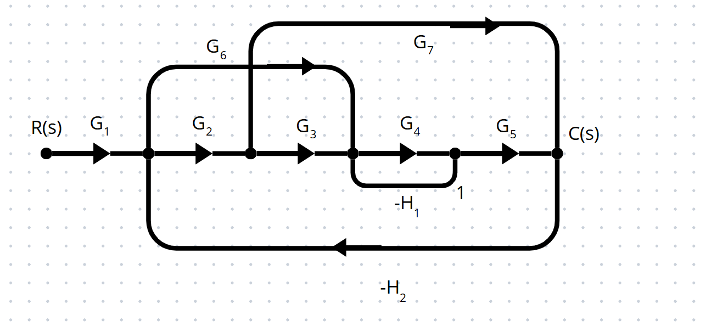
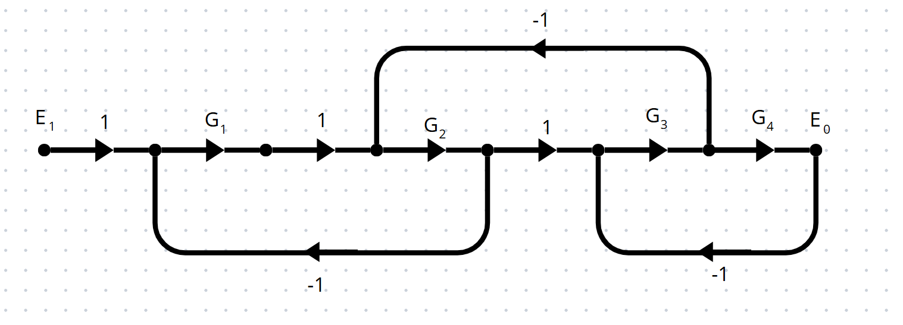
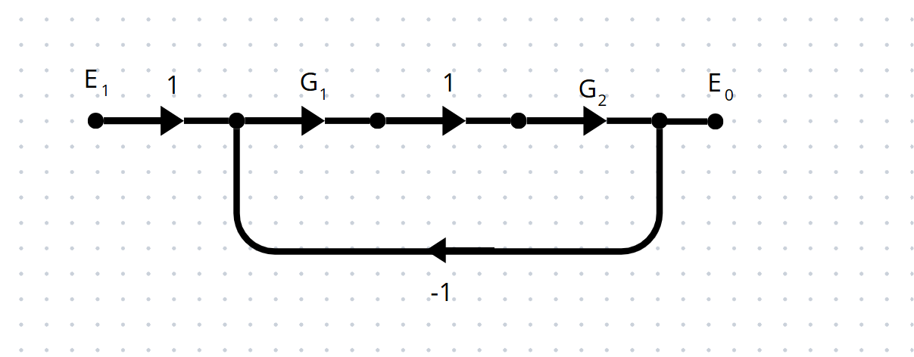

# DIAGRAMA  DE FLUJO DE SEÑALES
En esta clase abordamos conceptos básicos sobre caminos y lazos en sistemas representados por grafos dirigidos. Un camino o trayecto es una secuencia de ramas conectadas en el sentido de sus flechas; si no se repite ningún nodo, el camino es abierto, y si inicia y termina en el mismo nodo sin repetir otros, es un lazo o camino cerrado. La ganancia de un lazo es el producto de las ganancias de las ramas que lo componen.

También definimos los trayectos directos, que son caminos desde un nodo de entrada hasta un nodo de salida sin repetir nodos, y cuya ganancia es el producto de las ganancias de sus ramas.

Luego, aprendimos sobre la fórmula de Mason, una herramienta para calcular la función de transferencia total de sistemas complejos de manera sistemática. Esta fórmula utiliza las ganancias de los trayectos directos ($P_k$), los determinantes $\Delta$ y $\Delta_k$, que se construyen considerando lazos que no se tocan entre sí y su relación con cada trayecto.

## 1. DIAGRAMA DE FLUJO DE SEÑALES
>🔑 Este tipo de diagramas proporciona una forma alternativa de representar sistemas complejos, permitiendo simplificar el proceso de obtención de la función de transferencia total. Además, la fórmula de Mason resulta especialmente útil para calcular dicha función en sistemas con múltiples lazos o estructuras altamente complejas.
## 2. ELEMENTOS
*FLECHA*

Es la relación entre las variables del sistema

  

*NODO*

  
  Es la representación de señales
  
  

## 3. INTERPRETACION
Dado que el nodo representa una señal y la flecha indica la relación entre variables, cuando una flecha parte de un nodo —es decir, cuando hay una conexión de entrada a salida—, se interpreta que la señal de salida es igual a la señal de entrada multiplicada por la ganancia o relación entre esas variables.

 
  

$$Y(s)=F(s)X(s)$$

Cuando varias señales convergen en un mismo nodo, se interpreta que en ese punto se realiza la suma de todas ellas, cada una multiplicada por su respectiva ganancia.

 
  

$$Y(s)=F_{1}(s)X_{1}(s)+F_{2}(s)X_{2}(s)-F_{3}(s)X_{3}(s)$$

## 3. DEFINICIONES

>🔑*Camino o trayectoria* : Un camino o trayectoria es un recorrido por una secuencia de ramas (aristas) conectadas siguiendo el sentido de las flechas en un grafo dirigido.

>🔑* Camino abierto* : Si en dicho recorrido no se visita ningún nodo más de una vez (es decir, no se repiten nodos), se dice que el camino o trayectoria es abierto.

>🔑*Ciclo simple* : Si el camino o trayectoria comienza y termina en el mismo nodo, y no se repite ningún otro nodo en el recorrido, se dice que es un camino o trayectoria cerrado (también conocido como ciclo simple o circuito simple).
Ganancia de lazo: Es el producto de las ganancias de las ramas que forman un lazo (ciclo).

>🔑*Trayecto o camino directo* : Es un camino que conecta un nodo de entrada con un nodo de salida, sin cruzar ningún nodo más de una vez.

>🔑*Ganancia de trayecto directo* : Es el producto de las ganancias de las ramas que componen ese trayecto directo.

>🔑*Lazo* : Un lazo es un camino o trayecto cerrado, es decir, que comienza y termina en el mismo nodo sin pasar por ningún otro nodo más de una vez.

>🔑*Ganancia de lazo* : Es el producto de las ganancias de las ramas que conforman ese lazo.

## 4. FORMULA DE MASON
$$P=\frac{1}{\Delta }\sum P_{k}\Delta _{k}$$

La fórmula de Mason, también conocida como Teorema de Mason, fue desarrollada por Samuel Jefferson Mason en la década de 1950. Es una herramienta fundamental en teoría de sistemas y control para calcular la función de transferencia de sistemas representados mediante diagramas de flujo o grafos dirigidos. La fórmula permite obtener la relación entre la salida y la entrada del sistema considerando todos los caminos directos y lazos del grafo, sin necesidad de simplificar el sistema manualmente. Esto facilita el análisis de sistemas complejos de forma sistemática y eficiente.

COEFICIENTES

- $p_k$ es la ganancia o es igual a la ganancia de los caminos directos.

- $\Delta$ es igual a $1$ menos la suma de las ganancias de los lazos, más la suma producto de los lazos que no se toquen, menos la suma producto de tres lazos que no se toquen, más puntos suspensivos.

- $\Delta_k$ es igual a $1$ menos la suma de las ganancias de los lazos que no toquen la trayectoria $P_k$, más la suma de las ganancias de los lazos que no toquen la trayectoria $P_k$ y que no se toquen entre sí, menos la suma de las ganancias de tres lazos que no toquen la trayectoria $P_k$ y que no se toquen entre sí.
- 
💡**Ejemplo 1:**

 
  

Trayectorias Directas

$P_1 = 1 \times 1 \times G_1 \times G_2 \times G_3 \times 1 = G_1 \times G_2 \times G_3$

Lazos Cerrados

$L_1 = G_1 \times G_2 \times H_1$

$L_2 = - G_2 \times G_3 \times H_2$

$L_3 = - G_1 \times G_2 \times G_3$

Cofactores

$\Delta = 1 - L_1 + L_2 + L_3$

$\Delta_1 = 1$, porque todos los lazos tocan a $P_k$

$\frac{C(s)}{R(s)} = \frac{P_1 \times \Delta_1}{\Delta} = \frac{G_1 \times G_2 \times G_3}{1 - G_1 \times G_2 \times H_1 + G_2 \times G_3 \times H_2 + G_1 \times G_2 \times G_3}$

💡**Ejemplo 2:**

  

Ganancias de Trayectorias Directas

$P_1 = G1G2G3G4G5$

$P_2 = G1G6G4G5$

$P_3 = G1G2G7$

Lazos Cerrados

$L_1 = -G4H1$

$L_2 = -G2G7H2$

$L_3 = -G6G4G5H2$

$L_4 = -G2G3G4G5H2$

Cofactores

$\Delta_1 = 1$

$\Delta_2 = 1$

$\Delta_3 = 1 - L_1$

$\frac{CDS}{RDS} = \frac{1}{\Delta} (P_1 \Delta_1 + P_2 \Delta_2 + P_3 \Delta_3)$

Se reemplazan los datos utilizando las ecuaciones previamente definidas.

## 5.Ejercicios

### 5.1 📚Ejercicio 1: 

  

Directos

$P_1 = G1G2G3G4$

Lazos

$L_1 = -G1G2$

$L_2 = -G2G3$

$L_3 = -G3G4$

Cofactores

$\Delta_1 = 1$

$\Delta = 1 - (L_1 + L_2 + L_3) + L_1L_3$

$\frac{E_0}{E_1} = P = \frac{P_1 \Delta_1}{\Delta} = \frac{G1G2G3G4}{1 - (L_1 + L_2 + L_3) + L_1L_3}$

### 5.1 📚Ejercicio 2: 

  

Directos

$P_1 = 1 \cdot G1 \cdot 1 \cdot G2 = G1G2$

Lazos

$L_1 = -G1G2$

Cofactores

$\Delta_1 = 1$

$\Delta = 1 - L_1$

$\frac{E_0}{E_1} = P = \frac{P_1 \Delta_1}{\Delta} = \frac{G1G2}{1 - L_1}$

## 6. Conclusiones

La fórmula de Mason facilita el análisis de sistemas de control representados por diagramas de flujo, evitando cálculos manuales complejos al integrar de forma ordenada las ganancias de trayectos y lazos. Comprender cómo calcular las ganancias, identificar trayectos directos y lazos, y usar los determinantes $\Delta$ y $\Delta_k$ es clave para aplicar esta herramienta con éxito. Así, podemos obtener la función de transferencia total del sistema de manera eficiente y precisa, lo que es fundamental para el diseño y análisis de sistemas dinámicos.

## 7. Referencias

Clase Sistemas Dinamicos, Universidad ECCI

Ejercicio propuesto por el estudiante

