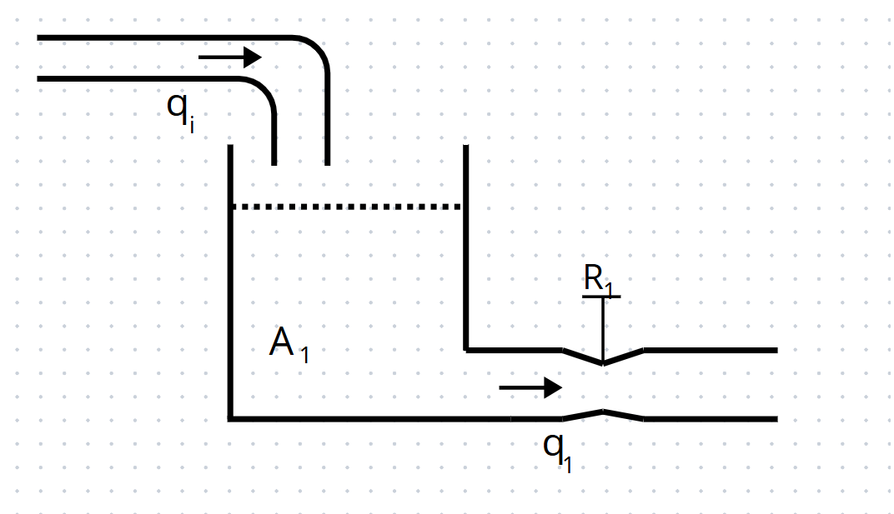
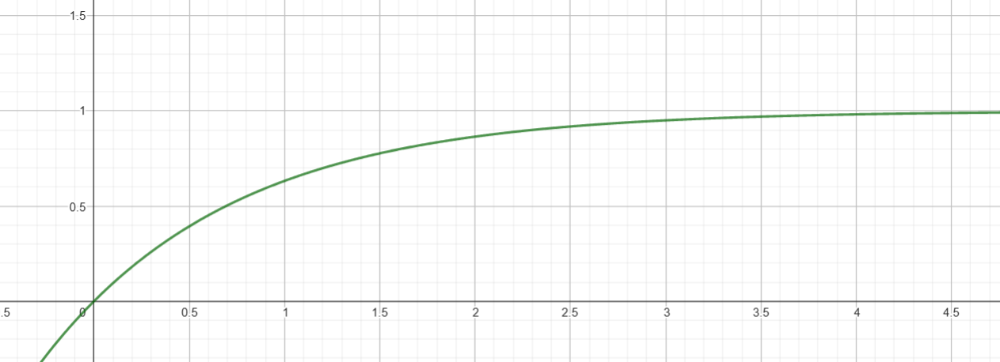
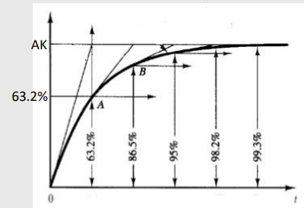
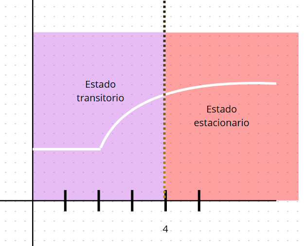
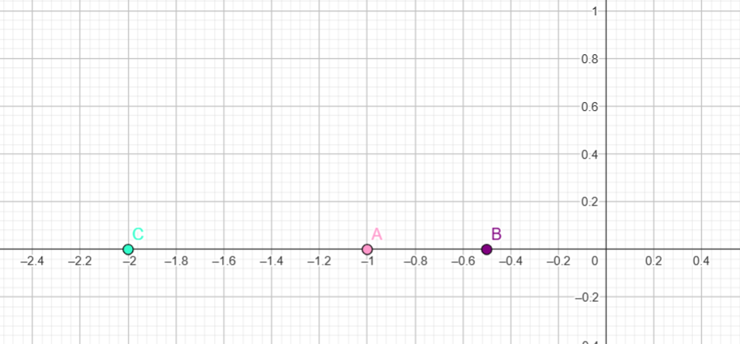
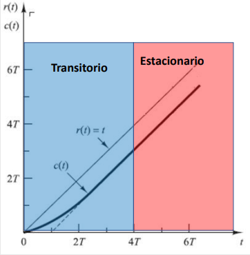
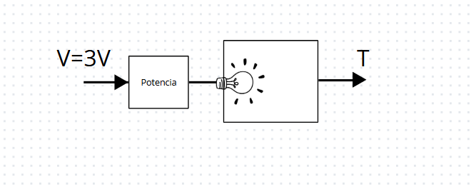

# ECUACIONES DIFERENCIALES DE PRIMER ORDEN

La clase trató sobre sistemas de primer orden descritos con ecuaciones diferenciales. Aprendimos a transformarlas usando Laplace y a expresarlas en forma canónica, lo que permite entender su comportamiento con dos parámetros clave: la constante de tiempo y la ganancia. También analizamos cómo responden a entradas como escalón y rampa, y cómo la posición del polo indica qué tan rápido actúa el sistema.

## 1. DESCRIPCIONES

La forma general de una ecuación diferencial de primer orden consiste en una combinación lineal de la derivada de la variable dependiente y la propia variable, igualada a una función de entrada.

$ay' + by = cu(t)$
Para obtener la función de transferencia del sistema, aplicamos la transformada de Laplace a la ecuación diferencial, considerando condiciones iniciales nulas:

Aplicando la transformada de Laplace:

$aY(s)s + bY(s) = cU(s)$

Despejando salida sobre entrada tenemos que: 

$\frac{y(s)}{u(s)} = \frac{c}{as + b}$

Las funciones de transferencia de primer orden se originan a partir de ecuaciones diferenciales de primer orden. Estas ecuaciones describen cómo evoluciona un sistema en función del tiempo y una entrada dada.

Al aplicar la transformada de Laplace, se puede observar que los parámetros constantes presentes en la ecuación diferencial también se mantienen en la función de transferencia resultante. Es decir, no se pierden en el proceso de transformación.

Los coeficientes $a$, $b$ y $c$ que aparecen en la ecuación diferencial representan parámetros físicos del sistema, como resistencias, inductancias, capacidades, masas o fricciones, dependiendo del tipo de sistema modelado. Estos parámetros son los que determinan el comportamiento dinámico del sistema.

💡**Ejemplo 1:**

 
  

$a\dot{y}(t) + b y(t) = c u(t)$  

$\frac{y(s)}{u(s)} = \frac{c}{as + b}$  

$r_1 a_1 \dot{h}_1 = r_1 q_i - h_1$

Estas constantes serían las equivalentes a las constantes de la ecuación diferencial que habíamos mostrado antes, de $\frac{c}{as + b}$.  

$a = r_1 a_1$  

$b = 1$  

$c = r_1$

Estas constantes serían las equivalentes a la ecuación diferencial que habíamos mostrado antes, de $as + b$.  

por lo cual, nos quedaría  

$\frac{h_1(s)}{q_i(s)} = \frac{r_1}{r_1 a_1 s + 1}$

## 2. FORMAS CANÓNICA

La forma general de la ecuación diferencial no permite identificar directamente los parámetros temporales del sistema. Por ello, en control se prefiere usar la forma canónica.

$$\frac{y(s)}{u(s)} = \frac{c}{as + b}$$

Para obtenerla, se divide por $b$ todos los términos de la función de transferencia, de modo que esta quede expresada como:

$\frac{y(s)}{u(s)} = \frac{\frac{c}{b}}{\frac{a}{b} s + 1}$

La forma canónica considera ciertas constantes importantes para caracterizar el sistema.

Primero, $\tau$ se define como $\frac{a}{b}$ y representa la constante de tiempo, que indica cuánto tarda el sistema en responder ante una entrada.

Luego, $k$ es igual a $\frac{c}{b}$ y se denomina ganancia estática, que indica el valor final o estado estacionario que alcanza la salida.

Por lo tanto, tomando en cuenta estas definiciones, la función de transferencia puede expresarse como la relación entre la salida y la entrada en el dominio de Laplace, dada por:

$$\frac{y(s)}{u(s)} = \frac{k}{\tau s + 1}$$

Siendo esta la forma canónica de sistemas de primer orden.

Ahora, nos devolvemos al ejercicio anterior donde  

$\frac{h_1(s)}{q_i(s)} = \frac{r_1}{r_1 a_1 s + 1}$  

Podemos identificar que  $k = r_1$     $\tau = r_1 a_1$

💡**Ejemplo 2:**
 $\frac{y(s)}{u(s)} = \frac{0.8}{s + 4}$  

Vamos a dividir todo por $b$ que sería 4, entonces nos queda  

$\frac{y(s)}{u(s)} = \frac{0.8}{4} \bigg/ \left(\frac{s}{4} + \frac{4}{4}\right)$  

$\frac{y(s)}{u(s)} = \frac{0.2}{\frac{1}{4} s + 1}$

Por lo cual $\tau$ sería $0.25$ y $k$ sería $0.2$

## 3. RESPUESTA TEMPORAL DE UN SISTEMA DE PRIMER ORDEN ANTE UNA ENTRADA ESCALON

$y(s) = u(s) \cdot \frac{k}{\tau s + 1}$

$y(s) = \frac{a}{s} \cdot \frac{k}{\tau s + 1}$

$y(s) = \frac{ak}{s(\tau s + 1)}$

Usando fracciones parciales:  

$y(s) = \frac{c_1}{s} + \frac{c_2}{s + \frac{1}{\tau}}$  

Nos queda que: 

$y(s) = \frac{ak}{s} - \frac{ak}{s + \frac{1}{\tau}}$  

Ahora aplicamos la transformada inversa de Laplace:  

$\mathcal{L}^{-1} \{ Y(s) \} = y(t) = ak \left(1 - e^{-t/\tau} \right)$

Si asumimos que $\tau=1$ y $AK=1$

 
  

 ### 3.1 Constante de tiempo del sistema
Teniendo que el sistema sera:
$$\mathcal{L}^{-1} \{ Y(s) \} = y(t) = ak \left(1 - e^{-t/\tau} \right)$$

Planteamos la tabla de relacion de $\tau$ vs $y(t)$

| *$\tau$*      | **y(t)** |
|---------------|----------------------------------------------|
|      $\tau$   |                      AK(0.632)               |
|      $2\tau$  |                       AK(0.86)               |
|      $3\tau$  |                       AK(0.950)              |
|      $4\tau$  |                     AK(0.981)                |
|    $5\tau$    |                       AK(0.99)               |

Dando un resultado de tal forma: 

  
  

Concluimos que el estado estacionario comienza en $4\tau$ (cuatro veces la constante de tiempo), según lo establecido para nuestro curso:

  
  

Durante el estado transitorio, el sistema experimenta una variación en su energía, mientras que en el estado estacionario dicha energía se mantiene constante, ademas $AK$ representa el valor máximo al que tenderá la función con el paso del tiempo, es decir, su valor en estado estacionario

## 4. POLOS

Los sistemas de primer orden se caracterizan por tener únicamente un polo en su función de transferencia

💡**Ejemplo 3:**

La función de transferencia de un sistema de primer orden tiene la forma:

$G(s) = \frac{K}{\tau s + 1}$

El polo del sistema se determina igualando el denominador a cero. Dependiendo del valor de $\tau$, obtenemos:

- Si $\tau = 1$, el denominador es $s + 1 = 0$, lo que implica que $s = -1$  
- Si $\tau = 2$, el denominador es $2s + 1 = 0$, despejando se obtiene $s = -\frac{1}{2}$  
- Si $\tau = \frac{1}{2}$, el denominador es $\frac{1}{2}s + 1 = 0$, y por tanto $s = -2$

Como los polos se grafican en el plano complejo de Numeros reales vs Numeros Imaginarios, se podran ver ubicados los polos de la siguiente manera:

  
  

>🔑Mientras más alejados estén los polos del sistema hacia la izquierda en el plano complejo (es decir, más negativos), mayor será la rapidez de respuesta del sistema.

## 5. RESPUESTA A ENTRADA RAMPA
ahora vamos a ver cómo responde el sistema a una entrada rampa, lo que significa que $U(s) = \dfrac{A}{s^2}$

entonces tenemos que $Y(s) = \dfrac{AK}{s^2(\tau s + 1)}$

vamos a utilizar fracciones parciales. escribimos:

$Y(s) = AK \left( \dfrac{1}{s^2} - \dfrac{\tau}{s} + \dfrac{\tau^2}{\tau s + 1} \right)$

ahora aplicamos la transformada inversa de Laplace:

$\mathcal{L}^{-1}[Y(s)] = y(t) = AK \left( t - \tau + \tau e^{-\frac{t}{\tau}} \right)$

  

  
  

Planteamos la tabla de relacion de $\tau$ vs $y(t)$

| *$\tau$*      | **y(t)** |
|---------------|----------------------------------------------|
|      $\tau$   |                      $AK\tau(e^{-1})$              |
|      $2\tau$  |                       $AK(\tau+\tau(e^{-2})$       |
|      $3\tau$  |                      $AK(2\tau+\tau(e^{-3})$       |
|      $4\tau$  |                     $AK(3\tau+\tau(e^{-4})$        |
|    $5\tau$    |                       $AK(4\tau+\tau(e^{-5})$     |

Como pudimos observar en la gráfica, va a tener en algún momento un comportamiento lineal, lo cual significa que vamos a poder calcular una pendiente de cómo trabajaría el sistema en esa parte. por lo cual podemos decir que:

$m = \dfrac{4\tau AK - 3\tau AK}{5\tau - 4\tau} = AK$

Esto nos indica que la pendiente $m$ del sistema, cuando recibe una entrada tipo rampa, es igual a $AK$.

💡**Ejemplo 4:**

  

  
  

$T(s)/V(s) = \dfrac{20}{8s + 1}$

A partir del sistema dado por la función de transferencia $T(s)/B(s) = \dfrac{20}{8s + 1}$, identificamos que el valor de la constante de tiempo $\tau$ es $8$, dado que esta corresponde al coeficiente del denominador lineal en la forma estándar.

Como en nuestro curso consideramos que el estado estacionario comienza en $4\tau$, entonces calculamos que:

$4\tau = 4 \cdot 8 = 32$

Esto indica que el sistema habrá alcanzado prácticamente su respuesta final alrededor del tiempo $t = 32$ unidades de tiempo.

Sabemos que el sistema tiene una entrada de $3$ voltios, por lo tanto:

$A = 3 \Rightarrow K = 20

Por lo cual el valor final de la función (el valor al que tiende la salida) es $60$, lo que implica que:

$AK = 60$

Finalmente, también recordamos que en los sistemas de primer orden, el valor de $\tau$ corresponde al 63% del valor final. Es decir, cuando $t = \tau$, la salida ha alcanzado aproximadamente el $63%$ del valor de $AK = 60$, es decir:

$y(\tau) \approx 0.63 \cdot 60 = 37.8$

## 6. CONCLUCIONES

Las ecuaciones diferenciales de primer orden permiten modelar sistemas físicos simples y lineales.

La forma canónica facilita el análisis y diseño de sistemas en control, pues expresa claramente la constante de tiempo $\tau$ y la ganancia $K$.

El comportamiento frente a entradas como escalón o rampa puede analizarse fácilmente aplicando Transformada de Laplace y técnicas como fracciones parciales.

El tiempo $\tau$ determina qué tan rápido responde el sistema, y al cabo de $4\tau$ se considera que ha llegado al estado estacionario.

La posición del polo en el plano complejo es clave para conocer la rapidez del sistema: cuanto más negativo el polo (más alejado del origen), más rápido será el sistema.

Estos conceptos son fundamentales en el diseño de sistemas de control, permitiendo prever su comportamiento ante diferentes condiciones de entrada.

## 7. REFERENCIAS

Apuntes del curso y presentaciones de la clase Sistemas Dinamicos dada por Jorge Cote.

